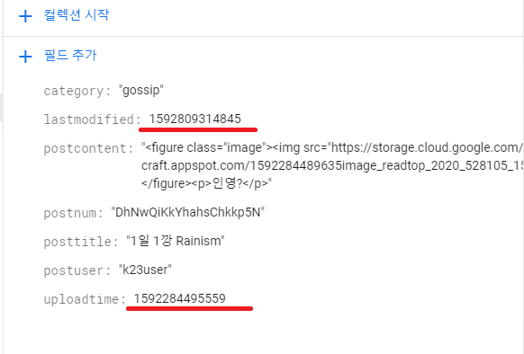

# JavaScript Timestamp

## Date.now()
나의 프로젝트에서 게시물을 올릴 때 시간에 대한 정보는 `uploadtime` 과 `lastmodified`에 저장을 한다. 그리고 저장시에는 `JavaScript` 의 `Date.now()`메소드를 활용한다.
`Date.now()` 메소드는 UTC 기준으로 1970년 1월 1일 0시 0분 0초부터 현재까지 경과된 밀리 초를 반환합니다.


위의 그림과 같이 저장되는 value의 값이 밀리초로 되어 있는 것을 볼 수 있다.

## Timestamp 표기하기  
나의 프로젝트는 Firestore에 저장되어 있는 데이터를 가져와서 게시물들을 보여줘야 한다. 내가 원하는 timestamp의 format은 2020-00-00 몇시:몇분 의 형태이다 . 내가 원하는 형태의 format을 만들어 줘야 한다는 것을 알고 밀리세컨즈의 데이터를 내가 원하는 형태로 바꾸어 주는 함수를 만들었다. 그리고 그 함수는 Server가 firestore에서 데이터를 가져온 후 client에게 response할 때 활용한다.  

## Timestamp My format  

```javascript
String.prototype.string = function (len) {
  var s = "",
    i = 0;
  while (i++ < len) {
    s += this;
  }
  return s;
};
String.prototype.zf = function (len) {
  return "0".string(len - this.length) + this;
};
Number.prototype.zf = function (len) {
  return this.toString().zf(len);
};

timeToString: function (snapshotData) {
    var time = new Date(snapshotData.uploadtime);
    var year = time.getFullYear();
    var month = (time.getMonth() + 1).zf(2);
    var day = time.getDate().zf(2);
    var hour = time.getHours().zf(2);
    var minutes = time.getMinutes().zf(2);
    snapshotData.uploadtime = `${year}-${month}-${day} ${hour}:${minutes}`;
    return snapshotData;
  }
```  
 1. zf()함수는 자리수를 맞추어 주는 함수이다. example) `a.zf(3)`을 한다면 a가 만약 9 라고 해도 009라는 형태로 나오게 되면서 통일성을 timestamp 형태의 통일성을 위한 것이다.
 2. `Date`의 메소드를 활용하여 년도,월,일,시간,분 등을 가져올 수 있다. 다만 여기서 `getMonth()`는 1월달을 0으로 리턴하기때문에 `+1`을 해줘야 한다.  
 3. getfullYear는 4자리를 가져오기 때문에 따로 `zf()`을 사용하지 않아도 된다.  
