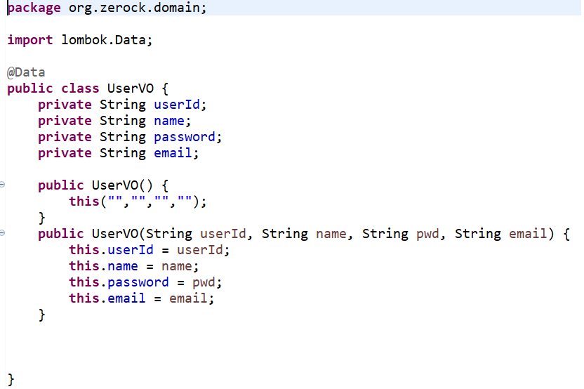
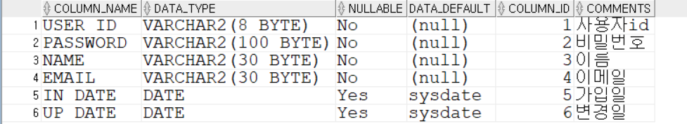
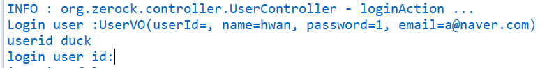
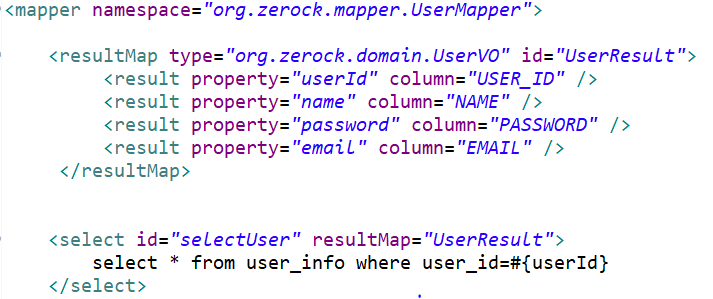

## org.springframework.web.util.NestedServletException: Request processing failed; nested exception is org.mybatis.spring.MyBatisSystemException

### 문제가 일어나는 경우

   1. mapper id가 다를 경우

   2. mapper가 정의되어 있지 않거나 스펠링의 오타

   3. mapper의 namespce 명칭이 겹치는 경우

   4. parameter와 bean의 filed명이 틀릴 때

   5. sql의 정의된 namespace가 VO의 namespace와 다를때

## 해결 방법
나의 경우에는 5번 sql과 VO의 namespace가 달라서 생겼다. sql에서는 _을 사용하는데 java에서는 _사용을 꺼린다.

해결방법은 3가지를 찾았습니다.

1.  UserVO 의 userId를 user_id로 바꾸는 방법 => getter/setter를 바꿔야 하는데 번거롭습니다.

2.  query문에서 as 을 사용해서 select user_id as userId,

3.  <resultMap> 사용해서 Mapping하기

해결방법중 3번을 활용하여 해결하였다.

